# Backup and Restore Configuration

**Difficulty:** Beginner

**Goal:** Learn to save, backup, and restore router/switch configurations using copy commands and a TFTP server.

## Network Diagram

```mermaid
graph LR
    Router["📡 Router"]
    TFTP["🗄️ TFTP Server<br/>192.168.1.100"]
    NVRAM["💾 NVRAM<br/>startup-config"]
    Router -->|"copy run start"| NVRAM
    Router <-->|"copy run tftp<br/>copy tftp run"| TFTP
```

## Lab Steps

### Step 1: View running configuration

Display the current running configuration to review before backup.

**Expected Commands:**

- `show running-config`

### Step 2: Save to startup-config

Copy the running configuration to startup-config (NVRAM) so it persists after reboot.

**Expected Commands:**

- `copy running-config startup-config`
- `write memory`
- `wr`

### Step 3: Backup to TFTP server

Copy the running configuration to a TFTP server at 192.168.1.100.

**Expected Commands:**

- `copy running-config tftp://192.168.1.100/router-backup.cfg`
- `copy running-config tftp`

### Step 4: View startup configuration

Verify the startup-config matches the running-config.

**Expected Commands:**

- `show startup-config`

### Step 5: Restore from TFTP

Restore a configuration from the TFTP server to running-config.

**Expected Commands:**

- `copy tftp://192.168.1.100/router-backup.cfg running-config`
- `copy tftp running-config`

### Step 6: Erase startup-config (optional)

If needed, erase the startup configuration to reset the device to factory defaults.

**Expected Commands:**

- `write erase`
- `erase startup-config`

## Simulated Outputs

- `show running-config` -> `[Current configuration displayed]`
- `show startup-config` -> `[Startup configuration displayed]`
- `copy running-config tftp://192.168.1.100/router-backup.cfg` -> `Writing router-backup.cfg... [OK]`
- `copy tftp://192.168.1.100/router-backup.cfg running-config` -> `Loading router-backup.cfg from 192.168.1.100... [OK]`

