# Basic Interface Troubleshooting

**Difficulty:** Beginner

**Goal:** Learn fundamental commands to troubleshoot interface issues: check status, verify IP configuration, identify speed/duplex mismatches, and view error counters.

## Network Diagram

```mermaid
graph TD
    Router["📡 Router<br/>Gi0/0: 192.168.1.1"]
    Switch["🔀 Switch<br/>Gi0/1"]
    PC["🖥️ PC<br/>192.168.1.10"]
    Router --> Switch
    Switch --> PC
    subgraph Commands["Troubleshooting Commands"]
        A["show ip interface brief"]
        B["show interface gi0/0"]
        C["show ip interface gi0/0"]
        D["no shutdown"]
    end
```

## Lab Steps

### Step 1: Check interface status summary

View a brief summary of all interfaces showing status (up/down) and protocol state.

**Expected Commands:**

- `show ip interface brief`

### Step 2: View detailed interface status

Check detailed information for GigabitEthernet0/0 including speed, duplex, and line protocol.

**Expected Commands:**

- `show interface gigabitEthernet0/0`
- `show interface gi0/0`

### Step 3: Check for interface errors

Look for input/output errors, CRC errors, collisions, and other counters that indicate problems.

**Expected Commands:**

- `show interface gi0/0 | include errors`
- `show interface gi0/0`

### Step 4: Verify IP address configuration

Confirm the IP address and subnet mask configured on the interface.

**Expected Commands:**

- `show ip interface gi0/0`
- `show running-config interface gi0/0`

### Step 5: Bring up a down interface

If an interface is administratively down, enable it with 'no shutdown'.

**Expected Commands:**

- `interface gi0/0`
- `no shutdown`

### Step 6: Set speed and duplex manually

If there's a duplex mismatch, manually configure speed and duplex (or set to auto).

**Expected Commands:**

- `interface gi0/0`
- `speed auto`
- `duplex auto`

### Step 7: Clear interface counters

Reset the error counters to monitor for new issues after a fix.

**Expected Commands:**

- `clear counters gi0/0`

## Simulated Outputs

- `show ip interface brief` -> `Interface       IP-Address      Status    Protocol\nGi0/0           192.168.1.1     up        up\nGi0/1           unassigned      down      down`
- `show interface gi0/0` -> `GigabitEthernet0/0 is up, line protocol is up\n  Hardware is Gigabit Ethernet\n  Internet address is 192.168.1.1/24\n  MTU 1500 bytes, BW 1000000 Kbit\n  Full-duplex, 1000Mb/s\n  5 minute input rate 1000 bits/sec\n  0 input errors, 0 CRC, 0 frame`
- `show ip interface gi0/0` -> `GigabitEthernet0/0 is up, line protocol is up\n  Internet address is 192.168.1.1/24\n  Broadcast address is 255.255.255.255`

