# Basic Router Initial Setup

**Difficulty:** Beginner

**Goal:** Configure a router from scratch: set hostname, secure console/VTY access with passwords, configure a login banner, and save the configuration.

## Network Diagram

```mermaid
graph TD
    Console["🖥️ Console PC"]
    Router["📡 Router R1"]
    Switch["🔀 Switch"]
    Console -->|"Console Cable"| Router
    Router --> Switch
    subgraph Security["Security Configuration"]
        A["hostname R1"]
        B["enable secret"]
        C["line console 0"]
        D["line vty 0 4"]
        E["banner motd"]
    end
```

## Lab Steps

### Step 1: Set hostname

Enter global configuration mode and set the router hostname to 'R1'.

**Expected Commands:**

- `enable`
- `configure terminal`
- `hostname R1`

### Step 2: Secure privileged EXEC mode

Set an encrypted enable secret password 'cisco123'.

**Expected Commands:**

- `enable secret cisco123`

### Step 3: Secure console access

Configure the console line with password 'console123' and require login.

**Expected Commands:**

- `line console 0`
- `password console123`
- `login`

### Step 4: Secure VTY (Telnet/SSH) access

Configure VTY lines 0-4 with password 'vty123' and require login.

**Expected Commands:**

- `line vty 0 4`
- `password vty123`
- `login`

### Step 5: Configure login banner

Set a message-of-the-day banner warning unauthorized users.

**Expected Commands:**

- `banner motd #Authorized Access Only#`
- `banner motd # Authorized Access Only #`

### Step 6: Save configuration

Save the running configuration to startup-config (NVRAM).

**Expected Commands:**

- `copy running-config startup-config`
- `write memory`
- `wr`

## Simulated Outputs

- `show running-config | include hostname` -> `hostname R1`
- `show running-config | include enable secret` -> `enable secret 5 $1$...`
- `show startup-config` -> `[Configuration saved]`

