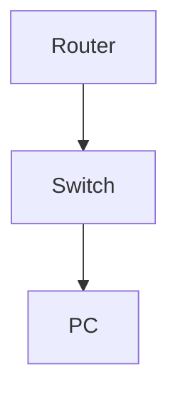

# Configure and Test Extended ACL for Web Restriction

**Difficulty:** Medium

**Goal:** Create an extended ACL to block HTTP/HTTPS from a subnet to the internet, permit all else, and verify.

## Network Diagram

## Lab Steps

### Step 1: Create extended ACL

Block TCP 80/443 from 10.1.1.0/24 to any, permit all else.

**Expected Commands:**

- `ip access-list extended BLOCK_WEB`
- `deny tcp 10.1.1.0 0.0.0.255 any eq 80`
- `deny tcp 10.1.1.0 0.0.0.255 any eq 443`
- `permit ip any any`

### Step 2: Apply ACL to interface

Apply to outbound interface toward internet.

**Expected Commands:**

- `interface gi0/0`
- `ip access-group BLOCK_WEB out`

### Step 3: Verify ACL

Test HTTP/HTTPS and other traffic from 10.1.1.0/24.

**Expected Commands:**

- `curl http://example.com`
- `curl https://example.com`
- `ping 8.8.8.8`

## Simulated Outputs

- `curl http://example.com` -> `Connection refused`
- `curl https://example.com` -> `Connection refused`
- `ping 8.8.8.8` -> `!!!!!`
