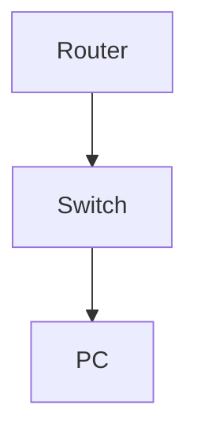

# Configure and Test HSRP for Gateway Redundancy

**Difficulty:** Medium

**Goal:** Set up HSRP on two routers for VLAN 10, verify failover, and test virtual IP.

## Network Diagram

## Lab Steps

### Step 1: Configure HSRP on R1

Set standby group 10, virtual IP 10.0.10.1, priority 110.

**Expected Commands:**

- `interface vlan 10`
- `ip address 10.0.10.2 255.255.255.0`
- `standby 10 ip 10.0.10.1`
- `standby 10 priority 110`

### Step 2: Configure HSRP on R2

Set standby group 10, virtual IP 10.0.10.1, priority 100.

**Expected Commands:**

- `interface vlan 10`
- `ip address 10.0.10.3 255.255.255.0`
- `standby 10 ip 10.0.10.1`
- `standby 10 priority 100`

### Step 3: Test failover

Shut down R1's VLAN 10 and verify R2 takes over.

**Expected Commands:**

- `interface vlan 10`
- `shutdown`
- `show standby`

## Simulated Outputs

- `show standby` -> `Group 10
  State is Active
  Virtual IP address is 10.0.10.1`
