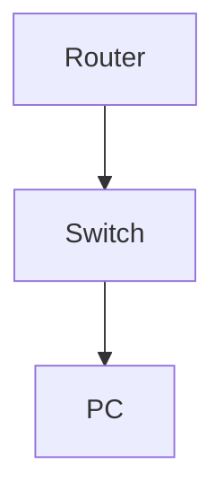

# Configure and Test NTP Authentication

**Difficulty:** Medium

**Goal:** Set up NTP with authentication key, configure trusted key, and verify time sync.

## Network Diagram

## Lab Steps

### Step 1: Configure NTP authentication

Set key 1 with password, mark as trusted.

**Expected Commands:**

- `ntp authentication-key 1 md5 NtpSecret`
- `ntp trusted-key 1`

### Step 2: Configure NTP server with key

Set NTP server 192.168.1.100 to use key 1.

**Expected Commands:**

- `ntp server 192.168.1.100 key 1`

### Step 3: Verify NTP sync

Check NTP status and associations.

**Expected Commands:**

- `show ntp status`
- `show ntp associations`

## Simulated Outputs

- `show ntp status` -> `Clock is synchronized, stratum 2, reference is 192.168.1.100`
- `show ntp associations` -> `*~192.168.1.100 .INIT. 1 64 377 0.123 0.000 0.001`
