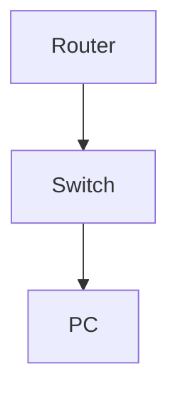

# Configure and Test Portfast and BPDU Guard

**Difficulty:** Medium

**Goal:** Enable Portfast on access ports and BPDU Guard to protect against accidental loops.

## Network Diagram

## Lab Steps

### Step 1: Enable Portfast

Enable spanning-tree portfast on Gi0/3.

**Expected Commands:**

- `interface gi0/3`
- `spanning-tree portfast`

### Step 2: Enable BPDU Guard

Enable BPDU Guard on Gi0/3.

**Expected Commands:**

- `spanning-tree bpduguard enable`

### Step 3: Test BPDU Guard

Simulate BPDU received and verify port is err-disabled.

**Expected Commands:**

- `show interfaces status`

## Simulated Outputs

- `show interfaces status` -> `Gi0/3  err-disabled  1G  a-full  a-100  10/100/1000BaseTX`
