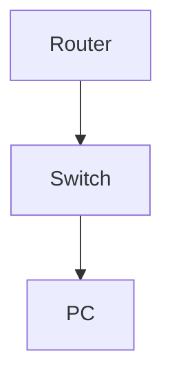

# Configure and Test Static Route with Floating Backup

**Difficulty:** Medium

**Goal:** Configure a static route with a higher administrative distance as a backup to a dynamic route.

## Network Diagram

## Lab Steps

### Step 1: Configure primary dynamic route

Enable OSPF and advertise 10.0.10.0/24.

**Expected Commands:**

- `router ospf 1`
- `network 10.0.10.0 0.0.0.255 area 0`

### Step 2: Configure floating static route

Add static route to 10.0.10.0/24 via backup next-hop with AD 200.

**Expected Commands:**

- `ip route 10.0.10.0 255.255.255.0 192.168.1.2 200`

### Step 3: Test failover

Shut OSPF neighbor and verify static route is used.

**Expected Commands:**

- `interface gi0/2`
- `shutdown`
- `show ip route`

## Simulated Outputs

- `show ip route` -> `S* 10.0.10.0/24 [200/0] via 192.168.1.2`
