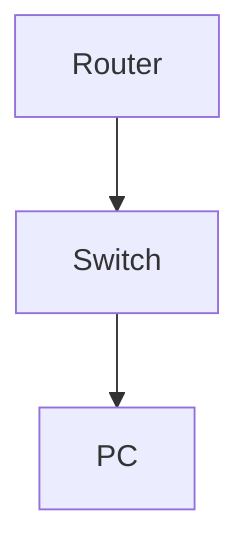

# Configure and Test Syslog with Severity Filtering

**Difficulty:** Medium

**Goal:** Configure a router to send syslog messages to a server, set severity to warnings and above, and verify logs.

## Network Diagram

## Lab Steps

### Step 1: Configure syslog server

Set logging host to 192.168.1.100 and trap level to warnings.

**Expected Commands:**

- `logging host 192.168.1.100`
- `logging trap warnings`

### Step 2: Generate test log

Shut down an interface to generate a warning.

**Expected Commands:**

- `interface gi0/1`
- `shutdown`

### Step 3: Verify logs on server

Check syslog server for warning message.

**Expected Commands:**

- `show logging`

## Simulated Outputs

- `show logging` -> `%LINK-5-CHANGED: Interface Gi0/1, changed state to administratively down`
