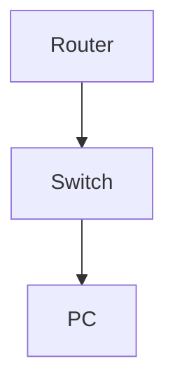

# Configure and Verify EtherChannel (LACP)

**Difficulty:** Medium

**Goal:** Bundle two switch ports using LACP, verify EtherChannel status, and test failover.

## Network Diagram

## Lab Steps

### Step 1: Configure EtherChannel

Set Gi0/1 and Gi0/2 to LACP active and bundle as Port-Channel 1.

**Expected Commands:**

- `interface range gi0/1-2`
- `channel-group 1 mode active`

### Step 2: Verify EtherChannel

Check EtherChannel summary and port status.

**Expected Commands:**

- `show etherchannel summary`

### Step 3: Test failover

Shut down Gi0/2 and verify traffic continues on Gi0/1.

**Expected Commands:**

- `interface gi0/2`
- `shutdown`
- `show etherchannel summary`

## Simulated Outputs

- `show etherchannel summary` -> `Group  Port-channel  Protocol    Ports
1      Po1(SU)         LACP      Gi0/1(P) Gi0/2(P)`
