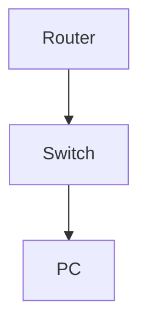

# Configure DHCP Snooping and Trust

**Difficulty:** Medium

**Goal:** Enable DHCP snooping globally, configure trusted and untrusted ports, and verify operation.

## Network Diagram

## Lab Steps

### Step 1: Enable DHCP snooping globally

Turn on DHCP snooping and specify VLAN 10.

**Expected Commands:**

- `ip dhcp snooping`
- `ip dhcp snooping vlan 10`

### Step 2: Configure trusted port

Set Gi0/1 as trusted (uplink to DHCP server).

**Expected Commands:**

- `interface gi0/1`
- `ip dhcp snooping trust`

### Step 3: Configure untrusted port

Set Gi0/2 as untrusted (user port).

**Expected Commands:**

- `interface gi0/2`
- `no ip dhcp snooping trust`

### Step 4: Verify DHCP snooping

Check the DHCP snooping binding table.

**Expected Commands:**

- `show ip dhcp snooping binding`

## Simulated Outputs

- `show ip dhcp snooping binding` -> `MacAddress          IpAddress      Lease      Type       VLAN  Interface
0011.2233.4455      10.0.10.11     3600       dhcp-snooping  10   Gi0/2`
