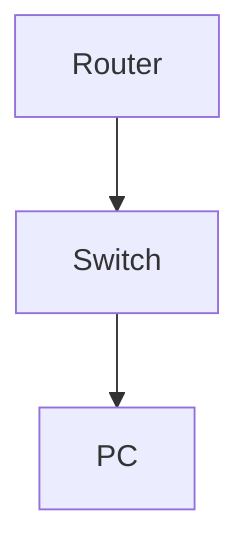

# Configure OSPF on Multiple Routers

**Difficulty:** Medium

**Goal:** Set up OSPF on two routers, advertise directly connected networks, and verify neighbor adjacency.

## Network Diagram

## Lab Steps

### Step 1: Enable OSPF and advertise networks on R1

Start OSPF process 1 and advertise 10.0.1.0/24 and 10.0.2.0/24.

**Expected Commands:**

- `router ospf 1`
- `network 10.0.1.0 0.0.0.255 area 0`
- `network 10.0.2.0 0.0.0.255 area 0`

### Step 2: Enable OSPF and advertise networks on R2

Start OSPF process 1 and advertise 10.0.2.0/24 and 10.0.3.0/24.

**Expected Commands:**

- `router ospf 1`
- `network 10.0.2.0 0.0.0.255 area 0`
- `network 10.0.3.0 0.0.0.255 area 0`

### Step 3: Verify OSPF neighbor adjacency

Check that R1 and R2 are OSPF neighbors.

**Expected Commands:**

- `show ip ospf neighbor`

## Simulated Outputs

- `show ip ospf neighbor` -> `Neighbor ID     Pri   State           Dead Time   Address         Interface
10.0.2.2        1     FULL/DR         00:00:33    10.0.2.2        Gi0/1`
