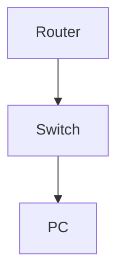

# Configure RADIUS Authentication for Switch Login

**Difficulty:** Medium

**Goal:** Set up AAA and RADIUS server authentication for switch console and VTY access.

## Network Diagram

## Lab Steps

### Step 1: Enable AAA and add RADIUS server

Enable AAA and add RADIUS server 10.0.0.5.

**Expected Commands:**

- `aaa new-model`
- `radius-server host 10.0.0.5 key radiuskey`

### Step 2: Configure login authentication

Set default login to use RADIUS, fallback to local.

**Expected Commands:**

- `aaa authentication login default group radius local`

### Step 3: Apply to console and VTY

Apply authentication to console and VTY lines.

**Expected Commands:**

- `line console 0`
- `login authentication default`
- `line vty 0 4`
- `login authentication default`

## Simulated Outputs

- `show running-config | include radius` -> `radius-server host 10.0.0.5 key radiuskey`
