# DHCP Relay and Central Server

Configure interface helper-addresses and create a central DHCP pool; validate with simulated client DHCP discovery.

## Diagram

```mermaid
graph LR
  n1[🗄️ Server]
  n2[📡 Router]
  n3[🔀 Main Switch]
  n4[🖥️ Workstation]
  n2 --> n3
  n3 --> n1
  n3 --> n4
```

## Steps

### Step : Configure helper on SVI
On SVI VLAN 30 add helper to point at DHCP server 10.0.0.5

**Expected:**
- `interface vlan 30\n ip helper-address 10.0.0.5`
### Step : Create central DHCP pool
Create DHCP pool for 10.0.30.0/24 on server configuration (simulated)

**Expected:**
- `ip dhcp pool GUEST\n network 10.0.30.0 255.255.255.0\n default-router 10.0.30.1`