# DNS Troubleshooting Lab

Investigate a DNS resolution failure: query server, check firewall, and fix missing host record.

## Diagram

```mermaid
graph LR
  n1[🗄️ Server]
  n2[📡 Router]
  n3[🔀 Main Switch]
  n4[🖥️ Workstation]
  n2 --> n3
  n3 --> n1
  n3 --> n4
```

## Steps

### Step : Run a DNS query
From client, run: nslookup www.example.com 10.0.0.5

**Expected:**
- `nslookup www.example.com 10.0.0.5`
- `dig @10.0.0.5 www.example.com`
### Step : Add missing A record
Add an A record for www.example.com pointing to 10.0.10.20 on the DNS server

**Expected:**
- `www IN A 10.0.10.20`
### Step : Verify resolution
Rerun the query and confirm the host now resolves

**Expected:**
- `nslookup www.example.com 10.0.0.5`
- `dig @10.0.0.5 www.example.com`