# Enable SNMP and Test Polling

Enable SNMPv2c and SNMPv3 user, configure a collector host and verify read access.

## Diagram

```mermaid
graph LR
  n1[📡 Router]
  n2[🔀 Main Switch]
  n3[🖥️ Workstation]
  n1 --> n2
  n2 --> n3
```

## Steps

### Step : Configure SNMP community and host

**Expected:**
- `snmp-server community MONRO ro 10`
- `snmp-server host 192.0.2.5 version 2c MONRO`
### Step : Configure SNMPv3 user

**Expected:**
- `snmp-server group SECLOCAL v3 priv`
- `snmp-server user admin SECLOCAL v3 auth sha AuthPass priv aes 128 PrivPass`
### Step : Verify

**Expected:**
- `show snmp user`
- `show snmp group`

## Simulated Outputs

- `show snmp user` => `User: admin, security model: v3`
- `show snmp group` => `Group: SECLOCAL, v3, priv`