# Inter-VLAN Routing and Voice DHCP

Goal: Configure a router-on-a-stick to support Data VLAN and Voice VLAN, create DHCP pools (including option 150) for phones, and verify phone provisioning.

## Diagram

```mermaid
graph LR
  n1([📡 Router])
  n1 --> n2([🔀 Switch])
  subgraph Wired Clients
    n3([📱 IP Phone])
    n4([🖥️ PC])
  end
  n2 --> n3
  n2 --> n4
```

## Visual Diagram

<svg xmlns="http://www.w3.org/2000/svg" width="500" height="480" viewBox="0 0 500 480">

<line x1="180" y1="200" x2="140" y2="80" stroke="#222" stroke-width="2" />
<line x1="180" y1="200" x2="80" y2="280" stroke="#222" stroke-width="2" />
<line x1="180" y1="200" x2="200" y2="280" stroke="#222" stroke-width="2" />
<line x1="180" y1="80" x2="300" y2="80" stroke="#222" stroke-width="2" />
<rect class="node" x="120" y="60" rx="6" ry="6" width="120" height="36" />
<text class="nlabel" x="128" y="80">📡 Router</text>
<rect class="node" x="120" y="180" rx="6" ry="6" width="120" height="36" />
<text class="nlabel" x="128" y="200">🔀 Switch</text>
<rect class="node" x="60" y="260" rx="6" ry="6" width="120" height="36" />
<text class="nlabel" x="68" y="280">📱 IP Phone</text>
<rect class="node" x="180" y="260" rx="6" ry="6" width="120" height="36" />
<text class="nlabel" x="188" y="280">🖥️ PC</text>
<rect class="node" x="280" y="60" rx="6" ry="6" width="120" height="36" />
<text class="nlabel" x="288" y="80">TFTP/Provision\n10.0.0.10</text>
</svg>

## Steps

### Step : Create VLANs and trunk
On switch create VLAN 10 and 20 and configure trunk to router interface.

**Expected:**
- `vlan 10\n name DATA`
- `vlan 20\n name VOICE`
- `interface gigabitEthernet0/1\n switchport mode trunk`
### Step : Router subinterfaces
Create Gi0/0.10 and Gi0/0.20 with appropriate IPs.

**Expected:**
- `interface gigabitEthernet0/0.10\n encapsulation dot1q 10\n ip address 10.0.10.1 255.255.255.0`
- `interface gigabitEthernet0/0.20\n encapsulation dot1q 20\n ip address 10.0.20.1 255.255.255.0`
### Step : Create DHCP pools
Create DHCP pool for DATA and VOICE (option 150 for TFTP).

**Expected:**
- `ip dhcp pool DATA\n network 10.0.10.0 255.255.255.0\n default-router 10.0.10.1`
- `ip dhcp pool VOICE\n network 10.0.20.0 255.255.255.0\n default-router 10.0.20.1\n option 150 ip 10.0.0.10`
### Step : Verify phone DHCP
From a simulated phone, run: show dhcp lease or check assigned IP and TFTP server.

**Expected:**
- `show ip dhcp binding`
- `ping 10.0.0.10`

## Simulated Outputs

- `ping 10.0.0.10` => `reply`
- `show ip dhcp binding` => `binding: phone->10.0.20.45`