# Interconnected Routers with DNS Server

Goal: Configure two routers, connected by a routed link, each with a managed switch and two PCs. Router B's switch hosts a DNS server that must serve both networks.

## Diagram

```mermaid
graph LR
  n1([📡 Router-A])
  n1 --> n5([🗄️ DNS Server\n10.0.20.10])
  n1 --> n3([🔀 Switch-A])
  subgraph Wired Clients
    n6([🖥️ PC A1])
    n7([🖥️ PC A2])
    n8([🖥️ PC B1])
    n9([🖥️ PC B2])
  end
  n3 --> n6
  n3 --> n7
  n3 --> n8
  n3 --> n9
```

## Visual Diagram

<svg xmlns="http://www.w3.org/2000/svg" width="740" height="480" viewBox="0 0 740 480">

<line x1="180" y1="200" x2="200" y2="80" stroke="#222" stroke-width="2" />
<line x1="240" y1="80" x2="400" y2="80" stroke="#222" stroke-width="2" />
<line x1="440" y1="80" x2="460" y2="200" stroke="#222" stroke-width="2" />
<line x1="500" y1="200" x2="540" y2="280" stroke="#222" stroke-width="2" />
<line x1="180" y1="200" x2="80" y2="260" stroke="#222" stroke-width="2" />
<line x1="180" y1="200" x2="200" y2="260" stroke="#222" stroke-width="2" />
<line x1="500" y1="200" x2="420" y2="260" stroke="#222" stroke-width="2" />
<line x1="500" y1="200" x2="500" y2="260" stroke="#222" stroke-width="2" />
<rect class="node" x="180" y="60" rx="6" ry="6" width="120" height="36" />
<text class="nlabel" x="188" y="80">📡 Router-A</text>
<rect class="node" x="380" y="60" rx="6" ry="6" width="120" height="36" />
<text class="nlabel" x="388" y="80">📡 Router-B</text>
<rect class="node" x="120" y="180" rx="6" ry="6" width="120" height="36" />
<text class="nlabel" x="128" y="200">🔀 Switch-A</text>
<rect class="node" x="440" y="180" rx="6" ry="6" width="120" height="36" />
<text class="nlabel" x="448" y="200">🔀 Switch-B</text>
<rect class="node" x="520" y="260" rx="6" ry="6" width="120" height="36" />
<text class="nlabel" x="528" y="280">🗄️ DNS Server\n10.0.20.10</text>
<rect class="node" x="60" y="240" rx="6" ry="6" width="120" height="36" />
<text class="nlabel" x="68" y="260">🖥️ PC A1</text>
<rect class="node" x="180" y="240" rx="6" ry="6" width="120" height="36" />
<text class="nlabel" x="188" y="260">🖥️ PC A2</text>
<rect class="node" x="400" y="240" rx="6" ry="6" width="120" height="36" />
<text class="nlabel" x="408" y="260">🖥️ PC B1</text>
<rect class="node" x="480" y="240" rx="6" ry="6" width="120" height="36" />
<text class="nlabel" x="488" y="260">🖥️ PC B2</text>
</svg>

## Steps

### Step : Configure VLANs on switches
On Sw-A create VLAN 10 and on Sw-B create VLAN 20. Assign PC access ports.

**Expected:**
- `vlan 10\n name DATA`
- `vlan 20\n name DATA`
### Step : Configure router subinterfaces or SVIs
On Router-A create subinterface Gi0/0.10 (10.0.10.1/24). On Router-B create Gi0/0.20 (10.0.20.1/24). Configure encapsulation dot1q.

**Expected:**
- `interface gigabitEthernet0/0.10\n encapsulation dot1q 10\n ip address 10.0.10.1 255.255.255.0`
- `interface gigabitEthernet0/0.20\n encapsulation dot1q 20\n ip address 10.0.20.1 255.255.255.0`
### Step : Configure routing between Router-A and Router-B
Add static routes or a routing protocol so 10.0.10.0/24 and 10.0.20.0/24 can reach each other.

**Expected:**
- `ip route 10.0.20.0 255.255.255.0 <next-hop>`
- `ip route 10.0.10.0 255.255.255.0 <next-hop>`
### Step : Configure DNS server and records
On the DNS server add A records for hostnames in both VLANs and point to 10.0.20.10 (server IP).

**Expected:**
- `www IN A 10.0.20.10`
- `hostA IN A 10.0.10.11`
- `hostB IN A 10.0.20.12`
### Step : Validate from PCs
From PC A1 and PC B1 run: ping 10.0.20.10 and nslookup www.example.com 10.0.20.10

**Expected:**
- `ping 10.0.20.10`
- `nslookup www.example.com 10.0.20.10`

## Simulated Outputs

- `ping 10.0.20.10` => `reply`
- `nslookup www.example.com 10.0.20.10` => `answer:10.0.20.10`