# IPsec Tunnel Verification

Basic site-to-site IPsec tunnel bring-up and verification (pre-shared key example).

## Diagram

```mermaid
graph LR
  n1[📶 Access point]
  n2[📡 Router]
  n3[🔀 Main Switch]
  n4[🖥️ Workstation]
  n2 --> n3
  n3 --> n4
```

## Steps

### Step : Define IKE/ISAKMP

**Expected:**
- `crypto isakmp policy 10`
### Step : Set PSK and crypto map

**Expected:**
- `crypto isakmp key SECRET address 198.51.100.2`
- `crypto map CM 10 ipsec-isakmp`
### Step : Verify tunnel

**Expected:**
- `show crypto isakmp sa`
- `show crypto ipsec sa`

## Simulated Outputs

- `show crypto isakmp sa` => `MM_KEY_EXCHANGE State: QM_IDLE\nPeer 198.51.100.2`
- `show crypto ipsec sa` => `interface: GigabitEthernet0/0, Crypto map tag: CM, #pkts encaps: 10`