# MPLS LDP Neighbor Bringup

Enable MPLS on core interfaces and verify LDP neighbor adjacencies and label bindings.

## Diagram

```mermaid
graph LR
  n1[📡 Router]
  n2[🔀 Main Switch]
  n3[🖥️ Workstation]
  n1 --> n2
  n2 --> n3
```

## Steps

### Step : Enable MPLS on interface

**Expected:**
- `mpls ip`
- `interface GigabitEthernet0/0\n mpls ip`
### Step : Enable LDP and verify neighbors

**Expected:**
- `mpls ldp router-id Loopback0 force`
- `show mpls ldp neighbor`
### Step : Verify forwarding table

**Expected:**
- `show mpls forwarding-table`

## Simulated Outputs

- `show mpls ldp neighbor` => `Peer 10.0.0.2 LDP id: 10.0.0.2:0, State: Oper`
- `show mpls forwarding-table` => `10.0.10.0/24 via label 16000`