# NAT Overload Verification

Configure PAT and verify multiple inside hosts can reach the internet using one public IP.

## Diagram

```mermaid
graph LR
  n1[📶 Access point]
  n2[📡 Router]
  n3[🔀 Main Switch]
  n4[🖥️ Workstation]
  n2 --> n3
  n3 --> n4
```

## Steps

### Step : Mark inside/outside and ACL
Set ip nat inside/outside on appropriate interfaces and create ACL for inside networks.

**Expected:**
- `interface GigabitEthernet0/0\n ip nat outside`
- `interface GigabitEthernet0/1\n ip nat inside`
- `access-list 10 permit 10.0.0.0 0.0.0.255`
### Step : Configure PAT
Create ip nat inside source list using interface overload.

**Expected:**
- `ip nat inside source list 10 interface GigabitEthernet0/0 overload`
### Step : Verify translations
Run show ip nat translations and check traffic counters.

**Expected:**
- `show ip nat translations`
- `show ip nat statistics`

## Simulated Outputs

- `show ip nat translations` => `10.0.0.10:12345 -> 203.0.113.10:54321\n10.0.0.11:12346 -> 203.0.113.10:54322`
- `show ip nat statistics` => `Total translations: 2`