# Static Routing Fundamentals

**Difficulty:** Beginner

**Goal:** Configure static routes on a router to enable communication between two networks that are not directly connected.

## Network Diagram

```mermaid
graph LR
    subgraph LAN_A["LAN A: 192.168.1.0/24"]
        PCA["🖥️ PC-A<br/>192.168.1.10"]
    end
    subgraph WAN["WAN Link: 10.0.0.0/24"]
        R1["📡 Router-1<br/>.1.1 | 10.0.0.1"]
        R2["📡 Router-2<br/>10.0.0.2 | .2.1"]
    end
    subgraph LAN_B["LAN B: 192.168.2.0/24"]
        PCB["🖥️ PC-B<br/>192.168.2.10"]
    end
    PCA --> R1
    R1 <-->|"Static Routes"| R2
    R2 --> PCB
```

## Lab Steps

### Step 1: View the routing table

On Router-1, display the current routing table to see directly connected networks.

**Expected Commands:**

- `show ip route`

### Step 2: Add static route on Router-1

Configure a static route to reach the 192.168.2.0/24 network via Router-2's interface (10.0.0.2).

**Expected Commands:**

- `ip route 192.168.2.0 255.255.255.0 10.0.0.2`

### Step 3: Add static route on Router-2

Configure a static route to reach the 192.168.1.0/24 network via Router-1's interface (10.0.0.1).

**Expected Commands:**

- `ip route 192.168.1.0 255.255.255.0 10.0.0.1`

### Step 4: Verify routing table

Check the routing table on Router-1 to confirm the static route is present (marked with 'S').

**Expected Commands:**

- `show ip route`
- `show ip route static`

### Step 5: Test connectivity

From Router-1, ping PC-B (192.168.2.10) to verify end-to-end connectivity.

**Expected Commands:**

- `ping 192.168.2.10`

## Simulated Outputs

- `show ip route` -> `C  192.168.1.0/24 is directly connected, Gi0/0\nC  10.0.0.0/24 is directly connected, Gi0/1\nS  192.168.2.0/24 [1/0] via 10.0.0.2`
- `show ip route static` -> `S  192.168.2.0/24 [1/0] via 10.0.0.2`
- `ping 192.168.2.10` -> `!!!!!\nSuccess rate is 100 percent (5/5)`

