# Switch Port Security

**Difficulty:** Beginner

**Goal:** Enable port security on a switch port to limit the number of MAC addresses and define violation actions to protect against unauthorized devices.

## Network Diagram

```mermaid
graph TD
    Switch["🔀 Switch<br/>Port Security Enabled"]
    Auth["🖥️ Authorized PC<br/>MAC: 0011.2233.4455"]
    Rogue["❌ Rogue Device<br/>BLOCKED"]
    Auth -->|"Gi0/1<br/>Allowed"| Switch
    Rogue -.->|"Violation: Shutdown"| Switch
    subgraph Config["Port Security Settings"]
        Max["maximum 1"]
        Mode["violation shutdown"]
        Sticky["mac-address sticky"]
    end
```

## Lab Steps

### Step 1: Access the interface

Enter interface configuration for GigabitEthernet0/1.

**Expected Commands:**

- `interface gigabitEthernet0/1`
- `interface gi0/1`

### Step 2: Set port to access mode

Configure the port as an access port (required for port security).

**Expected Commands:**

- `switchport mode access`

### Step 3: Enable port security

Enable port security on the interface.

**Expected Commands:**

- `switchport port-security`

### Step 4: Set maximum MAC addresses

Limit the port to allow only 1 MAC address.

**Expected Commands:**

- `switchport port-security maximum 1`

### Step 5: Configure violation action

Set the violation mode to 'shutdown' - port will be disabled if a second MAC is detected.

**Expected Commands:**

- `switchport port-security violation shutdown`

### Step 6: Enable sticky MAC learning

Configure the switch to dynamically learn and save the MAC address.

**Expected Commands:**

- `switchport port-security mac-address sticky`

### Step 7: Verify port security

Check the port security status and learned MAC addresses.

**Expected Commands:**

- `show port-security interface gi0/1`
- `show port-security address`

## Simulated Outputs

- `show port-security interface gi0/1` -> `Port Security: Enabled\nPort Status: Secure-up\nViolation Mode: Shutdown\nMaximum MAC Addresses: 1\nSticky MAC Addresses: 1`
- `show port-security address` -> `Gi0/1  0011.2233.4455  SecureSticky`

