# VXLAN EVPN Minimal Verification

Conceptual verification of VXLAN EVPN mapping: configure VNI and NVE, verify VNI and EVPN routes.

## Diagram

```mermaid
graph LR
  n1[📶 Access point]
  n2[📡 Router]
  n3[🔀 Main Switch]
  n4[🖥️ Workstation]
  n2 --> n3
  n3 --> n4
```

## Steps

### Step : Create VLAN and VNI mapping

**Expected:**
- `vlan 10`
- ` vn-segment 1010`
### Step : Configure NVE/VTEP basic

**Expected:**
- `interface nve1\n source-interface loopback0`
- ` member vni 1010`
### Step : Verify EVPN/VNI

**Expected:**
- `show evpn vni`
- `show nve peers`

## Simulated Outputs

- `show evpn vni` => `VNI 1010: state up`
- `show nve peers` => `Peer 10.0.0.11, VNI 1010`